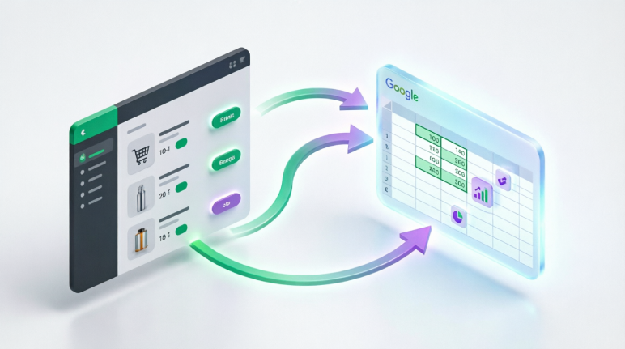
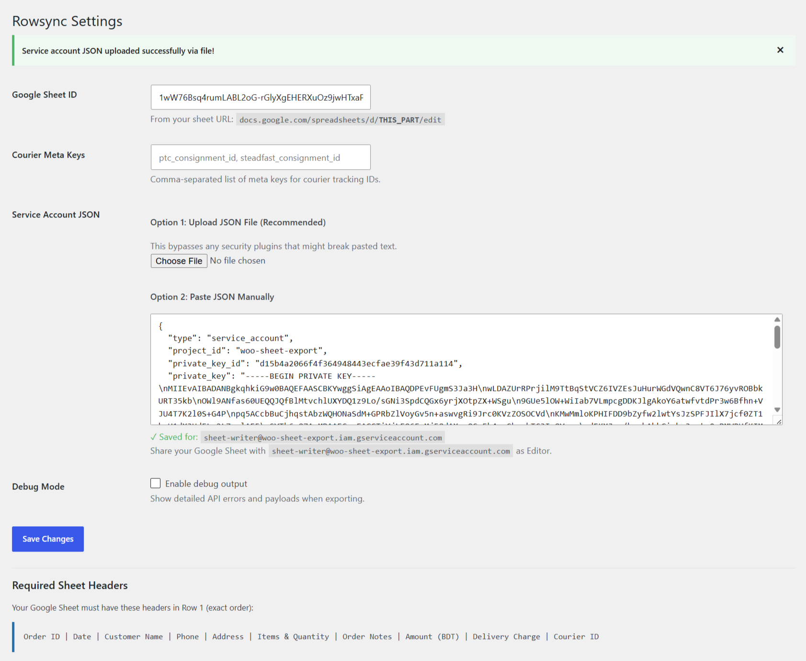
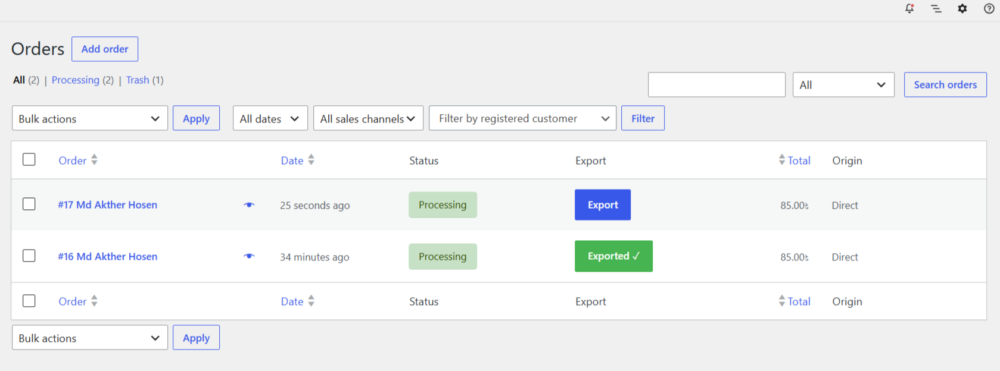
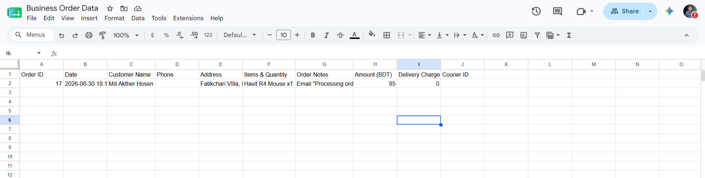

# Rowsync - WooCommerce to Google Sheets

**Rowsync** seamlessly connects your WooCommerce store to Google Sheets, allowing you to export order data with a single click. No monthly fees, no third-party connector services (like Zapier or SheetDB) — just a direct, secure integration using your own Google Cloud account.

## 🌟 Key Features

- **🔒 Bulletproof Key Parsing & File Upload:** Easily upload your Service Account JSON file directly. Our advanced parser automatically fixes hidden newline characters (`\n`), ensuring your private key never breaks, even if security plugins are installed.
- **🛡️ Smart Duplicate Prevention:** Once an order is exported, Rowsync automatically flags it in your database. The export button instantly changes to a green **"Exported ✓"** badge, preventing accidental duplicate entries.
- **📅 Automatic Daily Sheets:** Rowsync automatically creates a new sheet tab for each day based on the order date (e.g., `2026-07-01`). Keeps your data perfectly organized without creating one massive, slow spreadsheet.
- **📝 Auto-Header Injection:** If a daily sheet doesn't exist, Rowsync creates it and automatically adds the correct column headers before appending your data.
- ** Courier Tracking Integration:** Easily capture tracking IDs from popular courier plugins. Pre-configured for **Pathao** (`ptc_consignment_id`) and **Steadfast**, with fully customizable meta keys for any other courier.
- **🔌 Direct Google Sheets API:** Connects natively without middleman services. Your data stays 100% private and secure on your server.
- **⚡ HPOS Compatible:** Fully compatible with WooCommerce High-Performance Order Storage.

## 📊 Exported Fields

- Order ID
- Date & Time
- Customer Name
- Phone Number
- Address
- Items & Quantity
- Order Notes
- Amount
- Delivery Charge
- Courier Tracking ID

## 🚀 Installation

1. Upload the plugin files to the `/wp-content/plugins/rowsync` directory, or install the plugin through the WordPress plugins screen directly.
2. Activate the plugin through the 'Plugins' menu in WordPress.
3. Go to **Settings > Rowsync** to configure your Google Sheet ID and Service Account JSON.
4. Share your target Google Sheet with the service account email as an **Editor**.
5. Click the "Export" button on any WooCommerce order to export it to your Google Sheet.

### ⚙️ Google Cloud Setup Guide

1. Go to the [Google Cloud Console](https://console.cloud.google.com/).
2. Create a new Project (or select an existing one) and enable the **Google Sheets API**.
3. Go to **IAM & Admin > Service Accounts**, create a new service account, and generate a **JSON key**.
4. Download the JSON file to your computer.
5. In Rowsync settings, use the **"Upload JSON File"** option to upload the file you just downloaded.
6. Open your target Google Sheet, click **Share**, and paste the `client_email` found inside your JSON file, giving it **Editor** access.

## 📸 Screenshots

|                        Settings Page                        |                    Orders List                    |                       Google Sheets                       |
| :---------------------------------------------------------: | :-----------------------------------------------: | :-------------------------------------------------------: |
|                         |                 |                         |
| Configure your Sheet ID, upload JSON, and set courier keys. | One-click export with smart duplicate prevention. | Automatically generated daily sheets with proper headers. |

## Frequently Asked Questions

**Can I export the same order twice?**
No. Rowsync features smart duplicate prevention. Once an order is successfully exported, it is flagged in the database. The export button will change to a green "Exported ✓" badge.

**How do the Daily Sheets work?**
Rowsync automatically checks the date the order was placed. It will look for a sheet tab named after that date (e.g., `2026-07-01`). If it doesn't exist, it creates it, adds the headers, and appends the order.

**Why do I need to upload a JSON file instead of pasting it?**
Some WordPress security plugins and server firewalls strip out special characters (like backslashes) from pasted text. Because Google's private keys rely on these characters, pasting can sometimes break the key. The File Upload option reads the raw file directly from your server, completely bypassing this issue.

**Which courier plugins are supported?**
Rowsync works with any courier plugin that stores tracking IDs in order meta. By default, it checks for Pathao and Steadfast meta keys. You can easily add custom meta keys in the Rowsync settings page.

## 📝 Changelog

### 1.0.4

- Fixed inline JS/CSS enqueue, added external services documentation, and removed directory assets from zip.

### 1.0.3

- Added Bulletproof Private Key Parser to automatically fix hidden newline and carriage return issues.
- Improved JSON decoding fallback for keys saved with real newlines in the database.
- Enhanced error messaging for private key parsing failures.

### 1.0.2

- Added File Upload option for Service Account JSON to bypass security plugins that strip special characters.
- Improved private key parsing with multiple fallbacks.

### 1.0.1

- Fixed private key parsing issues for certain server environments.
- Improved JSON saving mechanism to preserve exact formatting.

### 1.0.0

- Initial release.
- One-click order export to Google Sheets.
- Automatic daily sheet creation based on order date.
- Auto-header injection for new sheets.
- Smart duplicate prevention (flags orders and disables button after export).
- Courier tracking ID support (Pathao, Steadfast, and custom keys).
- HPOS compatibility.
- Debug mode for troubleshooting.

## 🤝 Contributing

Contributions, issues, and feature requests are welcome! Feel free to check the [issues page](https://github.com/AktherHosen/rowsync/issues).

## 📄 License

This project is licensed under the **GPLv2 or later** License - see the [LICENSE](LICENSE) file for details.
